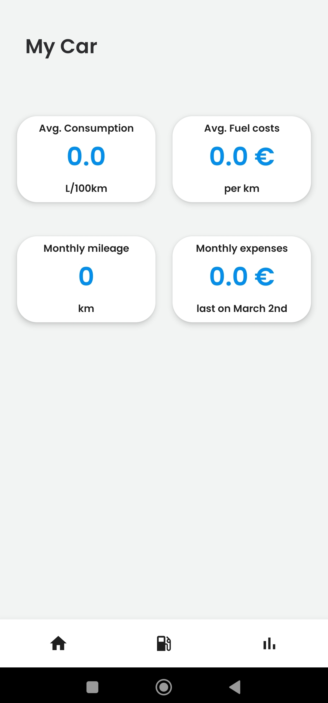
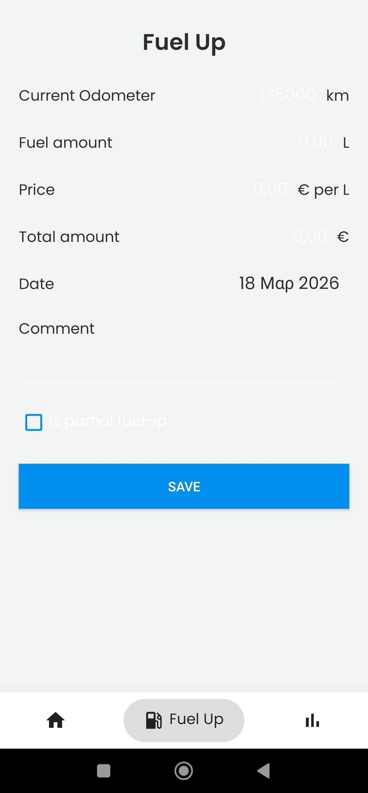
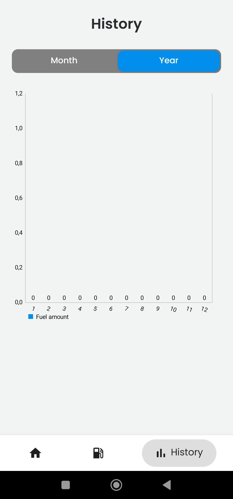

# FuelTracker 🚗⛽

A native Android application designed to help users track their vehicle's fuel consumption, manage expenses, and monitor fuel efficiency in real-time.

## 🌟 Features
* **Fuel Logging:** Easily record every refuel (liters, cost, odometer reading).
* **Consumption Analytics:** Automatic calculation of fuel consumption (L/100km or MPG).
* **Expense Tracking:** Keep a history of all fuel-related costs with monthly summaries.
* **Modern UI:** Clean and intuitive interface built with Material Design 3.

## 🛠 Tech Stack
* **Language:** [Kotlin]
* **IDE:** Android Studio
* **Database:** SQLite / Room Persistence Room
* **Architecture:** MVVM (Model-View-ViewModel)
* **UI Toolkit:** [XML Layouts / Jetpack Compose]

## 📸 Screenshots

<table>
  <tr>
    <td align="center">
      
       
      <em>Main Screen</em>
    </td>
    <td align="center">
      
       
      <em>Fuel Up</em>
    </td>
    <td align="center">
      
       
      <em>Stats screen</em>
    </td>
  </tr>
</table>

## 🚀 How to Run
1. Clone the repository: 
   `git clone https://github.com/geor45/FuelTracker.git`
2. Open the project in **Android Studio**.
3. Build and run the app on an emulator or a physical device (API 24+).

## 📄 License
This project is open-source and available under the MIT License.!
